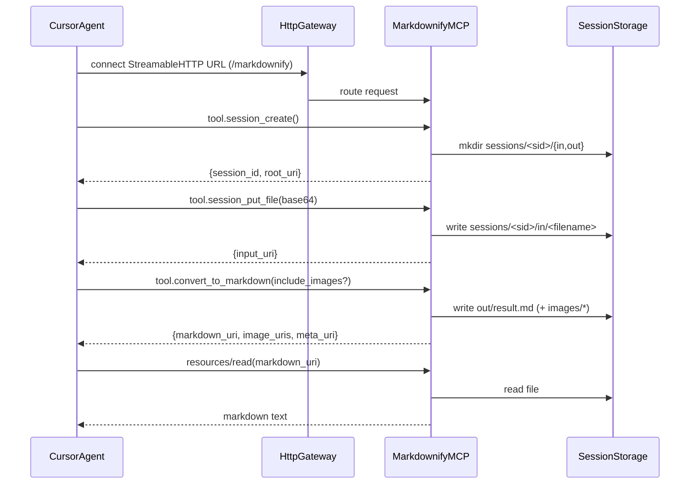

# Markdownify MCP（Streamable HTTP / `/markdownify`）

このディレクトリは、複数のMCP機能が同居するコンテナにおいて、**Excel / CSV / PDF を「構造を保って（ベストエフォート）」Markdown化し、必要ならPNG画像も生成**して返すMCP機能（Markdownify）を実装するための領域です。

本READMEは、**現時点で合意した設計・実装計画**をまとめたものです（※「今すぐ実装」はしません）。

---

## 前提（Cursor の MCP 対応）

Cursor は MCP のトランスポートとして **`stdio` / `SSE` / `Streamable HTTP`** をサポートしています（公式ドキュメント）:
- [Cursor Docs: Model Context Protocol (MCP) - 仕組み](https://docs.cursor.com/ja/context/mcp#%E4%BB%95%E7%B5%84%E3%81%BF)

本機能は、**複数機能同居 + パスで切り分け（`/markdownify`）**を実現しやすいように、**Streamable HTTP** を採用します。

---

## 目的 / ユースケース

- エージェントが受け取ったファイル（Excel/CSV/PDF）を **MCPツール経由でアップロード**する
- サーバー側で **構造を維持（ベストエフォート）**した Markdown を生成し、セッション領域に保存する
- エージェントはコンテナのファイルシステムを直接読めない前提なので、生成物を **MCP Resources（URI）** として公開し、`resources/read` 等で閲覧できるようにする
- オプションでPNG画像も生成する
  - **Excel**: シートに埋め込まれた画像を抽出（シートごとに整理）
  - **PDF**: 全ページをPNGレンダリング

---

## 同居方式（単一HTTPゲートウェイ + パスマウント）

このコンテナでは複数のMCP機能を同居させるため、**単一のHTTPゲートウェイ（単一ポート）**を起動し、機能ごとにパスでマウントします。

- `.../markdownify` : Markdownify MCP（本機能）
- 将来: `.../feature-a`, `.../feature-b` 等を同じゲートウェイに追加

### イメージ（データフロー）



---

## ディレクトリ構成（このコンテナ内）

作業ディレクトリ（本リポジトリ）:
- **`/mcps/markdownify/`**

現時点で作成済みの骨組み:

```
/mcps/markdownify/
  README.md
  markdownify_app/
    converters/
  sessions/                  # 実行時生成物（セッションごとに入出力を保存）
```

実装時の想定（ファイルは今後追加）:

```
/mcps/markdownify/
  gateway.py                 # 単一HTTPゲートウェイ（/markdownify をマウント）
  markdownify_app/
    server.py                # MCPアプリ本体（tools/resources）
    storage.py               # セッション管理、パス正規化、上限制御
    converters/
      csv_converter.py
      excel_converter.py
      pdf_converter.py
  sessions/
    <session_id>/
      in/
      out/
        result.md
        meta.json
        images/
          excel/<sheet>/...
          pdf/page-001.png
```

---

## セッションストレージ設計

セッションルート:
- **`/mcps/markdownify/sessions/<session_id>/`**

ディレクトリ:
- `in/`: アップロードされた元ファイル
- `out/`: 生成物
  - `result.md`: Markdown本体（基本運用は **ファイル保存→URI返却**）
  - `meta.json`: 変換結果メタデータ（入力、変換条件、生成物一覧、警告、ページ/シート対応など）
  - `images/`: オプションで生成されるPNG群

セッションID:
- UUID等の衝突しない識別子を採用

TTL/削除:
- `ttl_seconds`（デフォルト例: 24h）をサポート
- 明示削除用に `session_delete(session_id)` ツールを提供

---

## MCPインターフェース設計（Tools / Resources）

Cursorは **Tools / Resources / Roots / Elicitation / Prompts** をサポート（前掲Cursor Docs参照）します。本機能では主に Tools と Resources を使います。

### Tools（案）

#### 1) `session_create(ttl_seconds?: int)`
- **目的**: セッション作成と作業領域準備
- **出力**: `session_id`, `root_uri`

#### 2) `session_put_file(session_id: str, filename: str, content_base64: str)`
- **目的**: 入力ファイルをbase64で受け取り `in/` に保存
- **出力**: `input_uri`（`session://...`）

#### 3) `convert_to_markdown(session_id: str, input_uri: str, include_images: bool=false, inline_result: bool=false, limits?: object)`
- **目的**: 入力ファイルをMarkdown化して `out/` に保存し、参照URIを返す
- **出力**: `markdown_uri`, `image_uris[]`, `meta_uri`
- **オプション**:
  - `include_images=true` の場合、Excel画像抽出 / PDFページPNGレンダリングを実施
  - `inline_result=true` の場合、サイズが小さい範囲で Markdown本文をレスポンスに同梱（ただし基本運用は **paths_only**）

#### 4) `session_list(session_id: str, prefix?: str)`
- **目的**: エージェントが「セッション領域の中身を閲覧」できるようにする
- **出力**: `items[{uri, mimeType, sizeBytes}]`

#### 5) `session_delete(session_id: str)`
- **目的**: セッション領域を削除

### Resources（案）

エージェントがFSを直読できない前提のため、生成物は **Resources** として提供します。

- URI形式: **`session://<session_id>/<relpath>`**
- 例:
  - `session://abcd/out/result.md`
  - `session://abcd/out/meta.json`
  - `session://abcd/out/images/pdf/page-001.png`

Resourcesの挙動（想定）:
- `resources/read` でファイル内容（text / binary）を返す
- 一覧は `session_list` で取得（または resources/list を提供）

---

## 変換仕様（形式別）

要件: **「正確に構造を維持」はベストエフォートでレイアウトも可能な限り保持**。ただしMarkdown単体では表現限界があるため、必要に応じて **HTMLテーブル併用**なども検討します（実装時に確定）。

### CSV → Markdown
- 文字コード・区切り（`,` / `\\t` 等）を推定して読み込み
- Markdownテーブルに変換
- 巨大ファイル対策:
  - `max_rows` / `max_cols` のような上限を設けて切り詰め
  - 切り詰めた場合は `meta.json` と Markdown末尾に注記

### Excel（`.xlsx`）→ Markdown +（任意）PNG
- シートごとにセクションを作る（例: `## Sheet: ...`）
- 表ブロック検出:
  - 空行/空列で分割し、複数表がある場合は表ごとに分ける
- 結合セル:
  - Markdownテーブルでは完全再現が難しいため、**代表値の配置＋注記**または **HTMLテーブル併用**でベストエフォート再現
- 画像（任意）:
  - シートに埋め込まれた画像を抽出してPNG化
  - 出力先: `out/images/excel/<sheet>/img-001.png` 等

### PDF（テキストPDF、OCRなし）→ Markdown +（任意）PNG
- ページ単位にテキスト抽出し、Markdown整形
- 表（ベストエフォート）:
  - 可能なら表を検出してMarkdown表へ整形（難しい場合はプレーンテキストとして残す）
- 画像（任意）:
  - 全ページをPNGレンダリング
  - 出力先: `out/images/pdf/page-XXX.png`

> 本設計では「スキャンPDF（OCR必要）」は対象外（要件でOCR不要と合意済み）。

---

## メタデータ（`meta.json`）案

変換結果の扱いをエージェント側で安全に・確実にするため、少なくとも以下を持たせます:

- `session_id`
- `input`:
  - `original_filename`
  - `detected_type`（csv/xlsx/pdf）
  - `size_bytes`
  - `sha256` 等（任意）
- `outputs`:
  - `markdown_uri`
  - `image_uris[]`
  - `warnings[]`（切り詰め、表検出失敗、結合セル近似、等）
- `limits_applied`:
  - `max_rows`, `max_cols`, `max_pages` 等

---

## 安全性（必須）

ファイルを受け取り、かつ変換処理（PDFレンダリング等）を行うため、最低限以下を必須要件とします。

- **パス正規化**:
  - `filename` は `..` / 絶対パス / NULLバイト等を拒否
  - セッションルート外への逸脱は完全に禁止
- **許可拡張子**: `.xlsx` `.csv` `.pdf`
- **サイズ・計算量制限**:
  - アップロードサイズ上限（例: 50MB）
  - PDFページ数上限（例: 200）
  - 画像生成枚数上限
  - 変換時間の上限（タイムアウト）
- **隔離**:
  - セッションディレクトリ外の読み書きは原則しない

---

## 実装フェーズ（このREADMEに基づく作業順）

1. **ゲートウェイ**: 単一HTTPゲートウェイを用意し、`/markdownify` にMCPアプリをマウント
2. **MCPコア**: Tools/Resourcesの骨組み（`session_create` / `session_put_file` / `resources/read` / `session_list`）
3. **変換器**: CSV / Excel / PDF を順に追加
4. **画像生成**: `include_images` オプションでExcel画像抽出・PDFページレンダリング
5. **制限/運用**: 上限設定、TTL、`meta.json`、エラーハンドリング

---

## Cursor 側設定例（参考）

Streamable HTTP の場合、Cursor 側はURLを指定して接続します（Remote Server設定のイメージ）。

```json
{
  "mcpServers": {
    "markdownify": {
      "url": "http://localhost:PORT/markdownify"
    }
  }
}
```

> 実際のキー名や配置場所は Cursor のMCP設定に従います（前掲Cursor Docs参照）。


